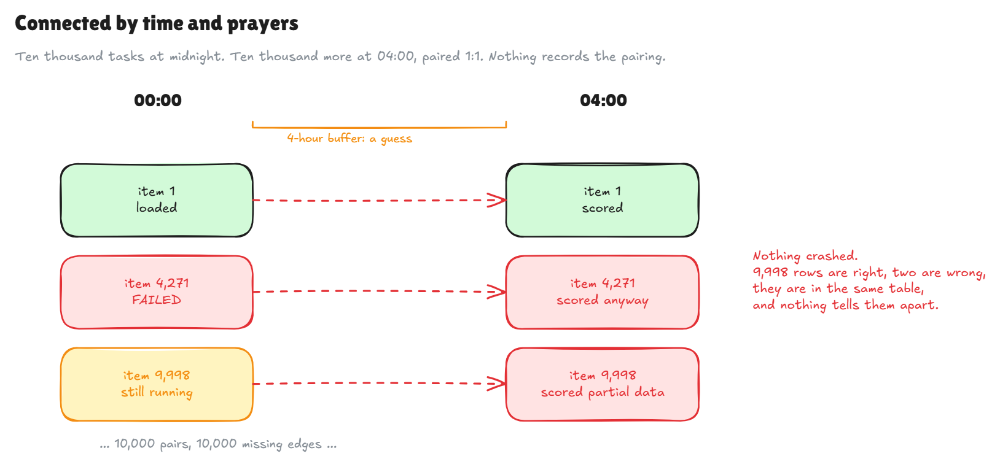
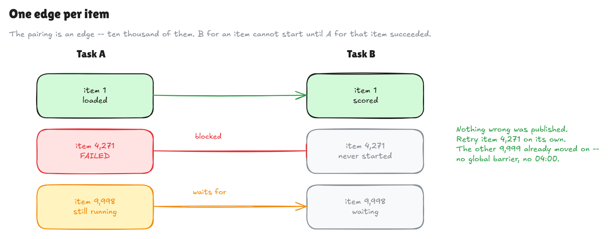
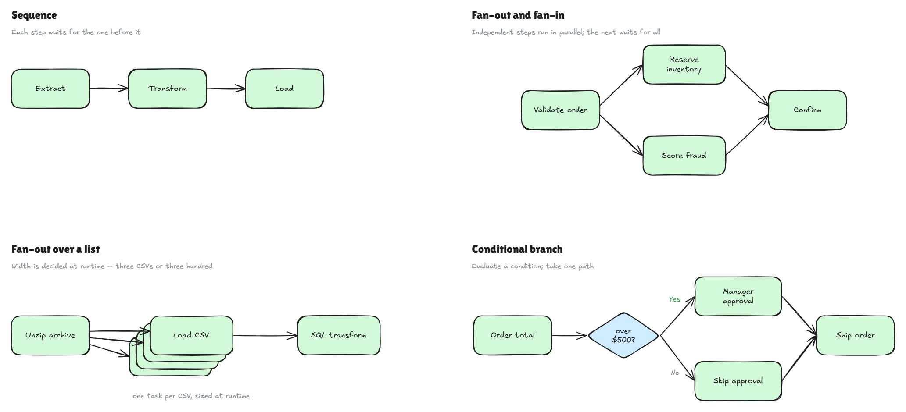
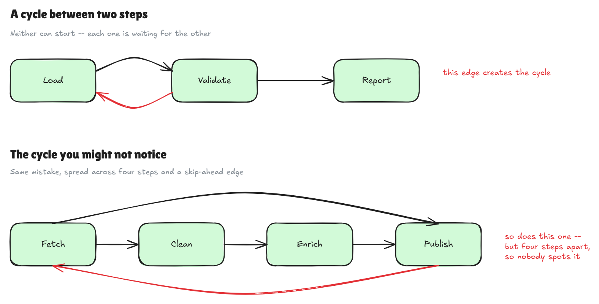
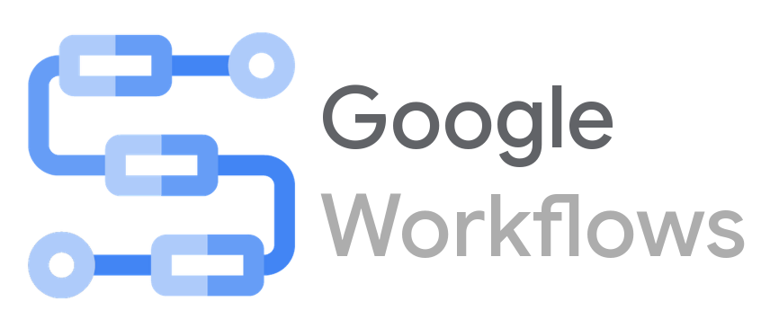

# Orchest-Rated
### Comparing Modern Workflow Orchestration Engines

<style>
/* Logo wall: uniform cells so a square mark and a 4.7:1 wordmark carry equal weight. */
.logo-grid {
  display: grid;
  grid-template-columns: repeat(4, 1fr);
  gap: 0.6em 1em;
  align-items: center;
}
.logo-grid figure { margin: 0; }
.logo-grid .cell {
  background: #fff;
  border-radius: 8px;
  height: 90px;
  display: flex;
  align-items: center;
  justify-content: center;
  padding: 8px;
  box-shadow: 0 1px 3px rgba(0,0,0,0.12);
}
.logo-grid img {
  max-width: 100%;
  max-height: 100%;
  object-fit: contain;
  margin: 0;
  border: none;
  background: none;
  box-shadow: none;
}
.logo-grid figcaption {
  font-size: 0.42em;
  color: #666;
  margin-top: 0.25em;
  text-align: center;
}
/* Exported Excalidraw diagrams have a white background; frame them so the plate reads
   as a deliberate card against the beige theme rather than a bare rectangle. */
.diagram {
  border-radius: 10px;
  box-shadow: 0 2px 10px rgba(0,0,0,0.15);
  background: #fff;
}
/* Per-tool cards: strengths/weaknesses as a borderless two-column table. */
.reveal table { font-size: 0.52em; border: none; width: 100%; }
.reveal table th {
  text-align: left; border: none;
  border-bottom: 2px solid rgba(0,0,0,0.25); padding-bottom: 0.2em;
}
.reveal table td { vertical-align: top; border: none; line-height: 1.5; width: 50%; }
/* The metadata strip directly under a tool name. */
.reveal h2 + p { font-size: 0.62em; }
.reveal pre { width: 100%; box-shadow: none; font-size: 0.42em; }
/* Small caption above a code block, for slides showing two sides of one contract. */
.reveal .note { font-size: 0.7em; }
.reveal ul.infra { font-size: 0.66em; }
.reveal ul.infra li { margin: 0.32em 0; }
/* Closing identity slide. */
.reveal section img.avatar {
  width: 250px; height: 250px; border-radius: 50%;
  object-fit: cover; display: block; margin: 0 auto 0.4em;
  border: none; background: none;
  box-shadow: 0 3px 16px rgba(0,0,0,0.28);
}
.whoami { text-align: center; }
.whoami .contacts {
  display: inline-grid; grid-template-columns: auto auto;
  gap: 0.18em 0.55em; text-align: left; font-size: 0.6em;
  margin-top: 0.55em; line-height: 1.5;
}
.whoami .contacts .ico { text-align: center; }
.whoami .role { font-size: 0.62em; color: #555; margin: 0.1em 0 0; }
.whoami .contact { font-size: 0.5em; color: #666; margin: 0.5em 0 0; }
.scoreboard { font-size: 0.46em; text-align: left; margin: 0 auto; max-width: 92%; }
.scoreboard .row { display: grid; grid-template-columns: 10em 2.6em 1fr; align-items: center; gap: 0.6em; margin: 0.2em 0; }
.scoreboard .n { text-align: right; font-weight: 700; }
.scoreboard .track { display: block; height: 1.05em; background: rgba(0,0,0,0.08); border-radius: 4px; }
.scoreboard .bar { display: block; height: 100%; background: #7f9a6b; border-radius: 4px; }
.scoreboard .row.top .bar { background: #2f9e44; }
.scoreboard .row.last .bar { background: #c99; }
.deployed { font-size: 0.5em; text-align: left; margin: 0 auto 0.3em; max-width: 88%; }
.deployed .row { display: grid; grid-template-columns: 13em 2.2em 1fr; align-items: center; gap: 0.55em; margin: 0.22em 0; }
.deployed .n { text-align: right; font-weight: 700; }
.deployed .track { display: block; height: 1em; background: rgba(0,0,0,0.08); border-radius: 4px; }
.deployed .bar { display: block; height: 100%; background: #7f9a6b; border-radius: 4px; }
.deployed .row.zero .n { color: #c0392b; }
.deployed .row.over .bar { background: #d9a05b; }
.reveal .codelabel {
  font-size: 0.45em; text-align: left; color: #555;
  margin: 0.5em 0 0.15em; font-style: italic;
}
.reveal pre code { max-height: none; padding: 0.8em 1em; }
.fragment {
   margin-top: 1em;
}
</style>

---

## What is workflow orchestration?

* The automated coordination of interdependent tasks
* More than a **scheduler** — scheduling is about *starting* work; orchestration is about everything after
* Useful for data pipelines, ETL, and any repeatable multi-step flow
* Modeled as a **Directed Acyclic Graph** (DAG)

---

## What does an orchestrator do?

* Enforces order
* Remembers where each run got to
* Handles failures and retries
* Coordinates concurrency
* Records history
* Suspends and resumes

---

## Isn't that just programming?

Python already has control flow:

* `if` / `else`
* `for` / `while`
* `try` / `except`

And retries are one decorator:

```python
from tenacity import retry, wait_exponential

@retry(wait=wait_exponential(multiplier=1, min=4, max=10))
def perform_task(): ...
```

---

## Yes, but…

* What if the process dies?
* How do you see what happened — across thousands of executions?
* How do you know what step it's on?
* How do you handle a pause, or a human in the loop?
* Where is the dependency between two steps actually *written down*?

---

## So what do people do?

### One option: a massive "do everything" script

`scripts/etl - Copy (2).py`

* Every step in one process. Easy to read.
* What happens when step 3 of 10 fails? Re-run from the top?
* What happens when you need to scale?
* What happens when you need a pause between steps 6 and 7?

---

## The do-it-yourself pitfall

* Backoff. Then jitter.
* A table tracking which items completed.
* Timeouts. Concurrency caps. Alerting.
* An admin page, so whoever is on-call at 3am isn't grepping logs.

<div class="fragment">
<strong>Congratulations, you have built a workflow orchestrator 🎉</strong>

But it's undocumented, fragile, and coupled to your business logic.
</div>

---

## Another option: scheduling independent tasks



---

## There's a better way

* We all know how to write tasks
* Reliably **gluing them together** is the issue

<div class="fragment">
Task code and scripts are the <strong>nodes</strong> in the graph.<br>
Workflow orchestration provides the <strong>edges</strong>.
</div>

---

## Pull the control flow out

* **Choice** states replace `if` / `else`
* **Parallel** states replace threads
* **Map** states replace `for` loops
* **Retry policies** replace decorators

<div class="fragment">
Same logic — but now the engine can see it, resume into it, and show it to you.
</div>

---

## Fixing the previous example



* One failure blocks one item — **visibly**
* No global barrier: item 1 never waits for item 9,998

---

## Directed Acyclic Graphs

* **Directed** — edges have a direction
* **Acyclic** — no cycles



---

## What you can't do



---

## Control plane / data plane

* **Control plane** — holds state, decides what's runnable, enqueues it
* **Data plane** — runs your code

<div class="fragment">
How those two connect is most of what separates the twelve.
</div>

---

## The 12-tool bake-off

<div class="logo-grid">
  <figure><div class="cell"></div><figcaption>Airflow</figcaption></figure>
  <figure><div class="cell"></div><figcaption>Argo Workflows</figcaption></figure>
  <figure><div class="cell"></div><figcaption>Conductor</figcaption></figure>
  <figure><div class="cell"></div><figcaption>Dagster</figcaption></figure>
  <figure><div class="cell"></div><figcaption>Flyte</figcaption></figure>
  <figure><div class="cell"></div><figcaption>Google Workflows</figcaption></figure>
  <figure><div class="cell"></div><figcaption>Hatchet</figcaption></figure>
  <figure><div class="cell"></div><figcaption>Kestra</figcaption></figure>
  <figure><div class="cell"></div><figcaption>Luigi</figcaption></figure>
  <figure><div class="cell"></div><figcaption>Prefect</figcaption></figure>
  <figure><div class="cell"></div><figcaption>Step Functions</figcaption></figure>
  <figure><div class="cell"></div><figcaption>Temporal</figcaption></figure>
</div>

---

## The four benchmark DAGs

1. **CSV ETL** — dynamic parallel load into Postgres → SQL transform → Parquet
2. **API fan-out** — async callback (the workflow *suspends*) → branch → 30 parallel fetches
3. **Payment processing** — flaky gateway, backoff + jitter, retriable vs. terminal
4. **Order fulfillment** — human approval (*suspends*) → shipping → **saga compensation**

---

## What it took to stand this up

<ul class="infra">
  <li><strong>Four mock services</strong> — callback, approval, a flaky shipping API, a fixture API</li>
  <li><strong>A 400-line compose file</strong> — Postgres, those four services, four engines</li>
  <li><strong>A Kubernetes cluster</strong> — hosted in Oracle Cloud (for free)</li>
  <li><strong>AWS and GCP accounts</strong> — Lambdas, IAM, S3, ECR · Cloud Run, GCS — under Terraform</li>
  <li><strong>A hosted Postgres database</strong> — hosted free through Neon; shared by Step Functions and Google Workflows</li>
</ul>

<div class="fragment note">
The mocks had to be reachable from three places at once: a process on my laptop, a pod in
the cluster, and a Lambda in AWS.
</div>

---

## Twelve tools, five families

Grouped by what they **demand of your infrastructure** — not by feature list.

1. **The data pipeline lineage** — Luigi, Airflow, Prefect, Dagster
2. **Durable execution engines** — Temporal, Hatchet
3. **Server-side declarative engines** — Conductor, Kestra
4. **Kubernetes-native** — Argo Workflows, Flyte
5. **Managed cloud serverless** — Step Functions, Google Workflows

---

## The data pipeline lineage

### Luigi · Airflow · Prefect · Dagster

* All **Python**, authored as Python code
* All descend from the same problem: a growing pile of batch jobs with dependencies
* Shared strength: the **largest ecosystems** and the **best audit trails**
* Shared weakness: **Python-only**, and every task shares the worker's environment by default

---

## Luigi

**Written in** Python · **You write** Python · **Score** 38 / 100

```python
class LoadCSVToPostgres(luigi.Task):
    csv_path = luigi.Parameter()

    def output(self):          # the Target IS the state
        return luigi.LocalTarget(f"markers/loaded_{self.csv_path}.json")

    def run(self):
        ...                    # retries, branching, rollback: all hand-written
```

| Strengths | Weaknesses |
|---|---|
| • No engine, no daemon, no database — just `python dag1.py`<br>• Target-based idempotency: re-runs skip completed work<br>• `--local-scheduler` runs the whole pipeline in the invoking process | • No suspend, no dependency isolation<br>• Weakest audit trail here — status only, never inputs or outputs<br>• Retries and compensation live inside task bodies — invisible to the engine |

---

## Apache Airflow

**Written in** Python · **You write** Python · **Score** 65 / 100

```python
load_csv = PythonOperator.partial(
    task_id="load_csv", python_callable=load_csv_fn,
    max_active_tis_per_dag=10,                     # the spec's concurrency cap
).expand(op_kwargs=unzip_file.output.map(lambda p: {"csv_path": p}))

unzip_file >> load_csv >> run_sql_transform >> convert_to_parquet
```

| Strengths | Weaknesses |
|---|---|
| • Best audit trail in the field, with unlimited retention<br>• Enormous ecosystem; three managed offerings<br>• Free OIDC SSO | • Python-only; shared worker environment by default<br>• Fan-out *width* is dynamic; the *shape* is fixed at parse time<br>• A missing `PYTHONPATH` hangs waiting tasks forever, silently |

---

## Prefect

**Written in** Python · **You write** Python · **Score** 67 / 100

```python
@flow(task_runner=ThreadPoolTaskRunner(max_workers=10))
def csv_etl_pipeline(zip_path: str) -> dict:
    csv_paths = unzip_file(zip_path)               # ordinary, eager Python
    loads = load_csv_to_postgres.map(csv_paths, db_config=unmapped(cfg))
    return convert_to_parquet(run_sql_transform(loads))
```

| Strengths | Weaknesses |
|---|---|
| • The flow body is **eagerly executed Python** — a whole class of bug is unwritable<br>• Existing scripts migrate by adding decorators<br>• Genuine suspend, including infrastructure teardown and rebuild | • Python-only<br>• Isolation is per *flow run*, not per task<br>• SSO needs paid Cloud; breaking changes across major versions |

---

## Dagster

**Written in** Python · **You write** Python · **Score** 68 / 100

```python
@op(out=DynamicOut(str))
def unzip_file(context):
    for path in extracted:
        yield DynamicOutput(path, mapping_key=key(path))

@graph
def csv_etl_graph():
    loads = unzip_file().map(load_csv_to_postgres).collect()
    convert_to_parquet(run_sql_transform(loads))
```

| Strengths | Weaknesses |
|---|---|
| • **Asset-centric** — you declare tables and lineage, not just jobs<br>• Audit trail among the best here — structured event log with asset lineage<br>• `dagster dev` gives a full local UI in one command | • **No native suspend** — waits become separate, sensor-bridged jobs<br>• Asset model has a real learning curve; smaller ecosystem<br>• The directory cannot be named `dagster/` — it shadows the library |

---

## Durable execution engines

### Temporal · Hatchet

* The workflow is **ordinary code** that survives the machine running it dying
* Aimed at application and microservice workflows, not data pipelines
* Shared strength: a crash resumes **mid-function**, not just at the last finished step
* Shared weakness: tasks share the worker environment
* Both schedule fine — but neither is **data-aware**

---

## Temporal

**Written in** Go · **You write** Go, Java, Python, TypeScript, PHP, .NET, Ruby · **Score** 88 / 100

```python
@workflow.defn
class ManagerApprovalWorkflow:
    @workflow.signal                                  # resumed from outside
    def submit_decision(self, decision: str): self._decision = decision

    @workflow.run
    async def run(self, input: RequestApprovalInput) -> ApprovalDecision:
        await workflow.execute_activity(request_approval, input, ...)
        await workflow.wait_condition(                 # suspends; no poller
            lambda: self._decision is not None, timeout=timedelta(seconds=120))
```

| Strengths | Weaknesses |
|---|---|
| • **A crash loses nothing** — a fresh process resumes on the same line, same variables<br>• Widest language support here: seven native SDKs<br>• Verified: survived `kill -9` mid-workflow, finished on a fresh process | • Schedules and backfill are built in, but nothing is **data-aware**<br>• Workflow code must be deterministic — no clocks, randomness, or I/O<br>• **Cannot tell you what is deployed** — no definition registry at all |

---

## Hatchet

**Written in** Go · **You write** Python, TypeScript, Go, Ruby · **Score** 70 / 100

```python
@manager_approval_wf.durable_task(execution_timeout=timedelta(hours=1))
async def wait_for_approval(input, context):
    result = await context.aio_wait_for(
        "approval",
        OrGroup(                                   # event OR timeout, whichever first
            UserEventCondition(event_key="approval.decided",
                               expression="input.order_id == '...'"),
            SleepCondition(timedelta(seconds=120))),
    )
```

| Strengths | Weaknesses |
|---|---|
| • **PostgreSQL and nothing else** — no Kafka, Redis, or Cassandra to operate<br>• Resumes from the last finished step (not mid-function); long waits are first-class<br>• One-off background tasks need no workflow boilerplate; MIT licensed | • Very young (Dec 2023), pre-1.0, small community<br>• **Worst auth of all twelve** — a built-in user DB you cannot replace<br>• Three defaults each cause a silent infinite hang |

---

## Server-side declarative engines

### Conductor · Kestra

* The workflow definition is **data, not code** — and it lives on the server
* JVM engine; tasks can be written in any language
* Shared strength: **change the graph without redeploying the workers**
* Shared weakness: authentication, and the repo stops being the source of truth

---

## Conductor

**Written in** Java · **You write** JSON + workers in Java, Python, Go, C#, TypeScript, Clojure · **Score** 75 / 100

<p class="codelabel">The graph is JSON on the server; the work is a Python process that polls for the task name</p>

```json
{ "name": "dag1_csv_etl", "tasks": [
  { "name": "process_csvs",         "taskReferenceName": "fanout", "type": "FORK_JOIN_DYNAMIC" },
  { "name": "load_csv_to_postgres", "taskReferenceName": "load",   "type": "SIMPLE" }
] }
```

```python
@worker_task(task_definition_name="load_csv_to_postgres")   # matches "name" above
def load_csv_to_postgres(file_path: str, table_name: str) -> dict:
    ...
    return {"table": table_name, "rows_loaded": len(rows)}
```

| Strengths | Weaknesses |
|---|---|
| • Definitions are versioned **server-side**, not in your repo<br>• `WAIT` resumes with one HTTP POST — no SDK, token, or relay | • **No authentication whatsoever** in OSS — the whole API is open<br>• **Timeouts fire late** — treat them as a floor, not a deadline |

---

## Kestra

**Written in** Java · **You write** YAML + script tasks in any language · **Score** 63 / 100

<p class="codelabel">Python lives inside the YAML, in its own container</p>

```yaml
  - id: load_csv_to_postgres
    type: io.kestra.plugin.scripts.python.Script
    taskRunner:
      type: io.kestra.plugin.scripts.runner.docker.Docker   # a container per task
    beforeCommands:
      - pip install kestra psycopg2-binary
    script: |
      ...                                   # ordinary Python from here down
      from kestra import Kestra             # the handoff back to the engine
      Kestra.outputs({"table": table, "rows_loaded": len(rows)})

  # downstream: "{{ outputs.load_csv_to_postgres.vars.rows_loaded }}"
```

| Strengths | Weaknesses |
|---|---|
| • Script tasks get **a Docker image each** — isolation is free<br>• Native `Pause` / `onResume` handled both waiting workflows | • **No dynamic task creation** — every task is fixed in the YAML<br>• One shared admin account in OSS; SSO is Enterprise-only |

---

## Kubernetes-native

### Argo Workflows · Flyte

* These do not merely *run on* Kubernetes — they **are** Kubernetes applications
* Every step is its own pod, with its own image
* Shared strength: **dependency isolation is inherent**, and scaling needs no workers
* Shared weakness: without a cluster there is no product — and the hosting cost is real

---

## Argo Workflows

**Written in** Go · **You write** YAML + any container · **Score** 74 / 100

```yaml
      - name: process-csvs
        template: process-csvs
        dependencies: [unzip-file]
        arguments:
          parameters:
            - name: csv-filenames
              value: "{{tasks.unzip-file.outputs.parameters.csv-filenames}}"
```

| Strengths | Weaknesses |
|---|---|
| • **Validates the whole call tree at submission**, before any pod starts<br>• Container per step: conflicting dependencies are impossible<br>• Free OIDC SSO with group-based RBAC; multi-arch images | • **Pod logs do not survive pod deletion**<br>• `retryPolicy: Always` cannot classify errors — it retries deliberate failures<br>• Host config is literal YAML — retargeting means editing every manifest |

---

## Flyte

**Written in** Go · **You write** Python · **Score** 70 / 100

```python
@workflow
def csv_etl_pipeline(etl_input: ETLInput) -> ETLOutput:
    csv_paths      = unzip_file(zip_file_path=etl_input.zip_file_path)
    load_results   = load_all_csvs(csv_paths=csv_paths, db_config=cfg)
    transform      = run_sql_transform(db_config=cfg)
    load_results >> transform    # REQUIRED: statement order implies nothing
```

| Strengths | Weaknesses |
|---|---|
| • One pod per task, including every fan-out element<br>• **Typed I/O persisted to blob storage** — readable after the pods are gone<br>• Config travels as *data* — retarget a run without touching code | • **Statement order means nothing** — edges come from data flow only, so two lines that don't share data run in parallel<br>• `retries=` is inert unless the exception subclasses `FlyteRecoverableException`<br>• The chart's defaults produce a healthy-looking install that cannot execute anything |

---

## Managed cloud serverless

### Step Functions · Google Workflows

* Require an account with **one specific cloud**; no self-hosting, no local path
* Billed **per state transition or step** — the only family where a chattier workflow costs money
* **The engine executes none of your code** — every step calls a service you deployed
* Shared strength: no infrastructure, inherent isolation, perfect scaling scores

---

## AWS Step Functions

**Closed-source** · **You write** JSON + any language · **Score** 60 / 100

```json
"ProcessCSVs": {
  "Type": "Map", "ItemsPath": "$.csv_keys", "MaxConcurrency": 10,
  "ItemProcessor": { "StartAt": "LoadCSVToPostgres", "States": {
      "LoadCSVToPostgres": { "Type": "Task",
        "Resource": "arn:aws:states:::lambda:invoke",
        "Retry": [{ "ErrorEquals": ["States.TaskFailed"],
                    "IntervalSeconds": 5, "MaxAttempts": 2, "BackoffRate": 2.0 }] } } }
}
```

| Strengths | Weaknesses |
|---|---|
| • Calls 220+ AWS services directly; Distributed Map fans out to 10,000<br>• Visual Workflow Studio; per-state I/O inspection with 90-day retention<br>• IAM-native authentication<br>•Costs are cheap for smaller workflows | • **Vendor independence: zero**<br>• **No dynamic task creation** — a Map cannot introduce a new kind of step<br>• ASL cannot nest — every sub-workflow is its own state machine<br>• **Costs can balloon quickly** — as things scale |

---

## Google Workflows

**Closed-source** · **You write** YAML + any language · **Score** 70 / 100

```yaml
- await_approval:
    call: events.await_callback          # genuinely suspended, up to 1 year
    args:
      callback: ${approval_callback}
      timeout: 120
    result: approval_result
```

| Strengths | Weaknesses |
|---|---|
| • **The best suspend/resume here** — truly suspended, for up to a year<br>• Deploys in one command; in-flight runs pin to their revision<br>• Up 11 points once we ran it — the largest movement in the comparison | • **The engine runs no code** — we built a 14-route service first<br>• Expression language has sharp edges — errors point away from the cause<br>• Retry sees HTTP status only — design retriability into your APIs |

---

## The scoring rubric

**100 points across 12 weighted categories**

<div style="column-count: 2; text-align: left; font-size: 0.62em;">

**10 points each**
* Language flexibility
* Dynamic task creation
* Dependency isolation
* What survives a crash
* Resume from failure
* Audit trail
* Scalability
* Vendor independence

**5 points each**
* Auth & SSO
* Community & maturity
* Local dev experience
* Suspend / resume

</div>

---

## The scoreboard

<div class="scoreboard">
  <div class="row top"><span>Temporal</span><span class="n">88</span><span class="track"><span class="bar" style="width:88%"></span></span></div>
  <div class="row"><span>Conductor</span><span class="n">75</span><span class="track"><span class="bar" style="width:75%"></span></span></div>
  <div class="row"><span>Argo Workflows</span><span class="n">74</span><span class="track"><span class="bar" style="width:74%"></span></span></div>
  <div class="row"><span>Flyte</span><span class="n">70</span><span class="track"><span class="bar" style="width:70%"></span></span></div>
  <div class="row"><span>Hatchet</span><span class="n">70</span><span class="track"><span class="bar" style="width:70%"></span></span></div>
  <div class="row"><span>Google Workflows</span><span class="n">70</span><span class="track"><span class="bar" style="width:70%"></span></span></div>
  <div class="row"><span>Dagster</span><span class="n">68</span><span class="track"><span class="bar" style="width:68%"></span></span></div>
  <div class="row"><span>Prefect</span><span class="n">67</span><span class="track"><span class="bar" style="width:67%"></span></span></div>
  <div class="row"><span>Airflow</span><span class="n">65</span><span class="track"><span class="bar" style="width:65%"></span></span></div>
  <div class="row"><span>Kestra</span><span class="n">63</span><span class="track"><span class="bar" style="width:63%"></span></span></div>
  <div class="row"><span>Step Functions</span><span class="n">60</span><span class="track"><span class="bar" style="width:60%"></span></span></div>
  <div class="row last"><span>Luigi</span><span class="n">38</span><span class="track"><span class="bar" style="width:38%"></span></span></div>
</div>

---

## Where a tool catches your mistake

* **At submission** — Argo and Conductor validate the whole call tree before a pod starts
* **One failed task at a time** — every Python-native tool
* **Never** — Flyte's missing `>>` edges were a *race*: correct-looking code, silently concurrent

<div class="fragment note">
This matters <strong>more</strong> when the code is generated. You are reviewing a workflow
you did not write — and "looks correct, runs in parallel" is exactly what a confident model
hands you.
</div>

---

## What can you see *before* it runs?

Same four workflows. Twelve UIs. **How many are listed as deployable?**

<div class="deployed">
  <div class="row zero"><span>Temporal · Prefect<br>Flyte · Luigi</span><span class="n">0</span><span class="track"><span class="bar" style="width:0%"></span></span></div>
  <div class="row"><span>Airflow</span><span class="n">4</span><span class="track"><span class="bar" style="width:21%"></span></span></div>
  <div class="row"><span>Step Functions</span><span class="n">7</span><span class="track"><span class="bar" style="width:37%"></span></span></div>
  <div class="row over"><span>Kestra <em>(for 7)</em></span><span class="n">13</span><span class="track"><span class="bar" style="width:68%"></span></span></div>
  <div class="row over"><span>Hatchet <em>(for 9)</em></span><span class="n">19</span><span class="track"><span class="bar" style="width:100%"></span></span></div>
</div>

<div class="fragment note">
<strong>Temporal lists none by design</strong> — no definition registry; the server learns a
type only when an execution appears. Prefect and Flyte list none until you register.<br>
Running and past executions are fully visible in all twelve. What is missing is the answer to
<strong>"what could run here that hasn't yet?"</strong>
</div>

---

## What I would recommend

* **Long-running service workflows → Temporal** — the only one that resumes *inside* a function, not just between steps
* **Data pipelines → Dagster** — best audit trail, plus the data-awareness Temporal lacks
* **Already deep in Kubernetes → Argo Workflows** — isolation and submission-time validation, *at modest volume*
* **All-in on one cloud, want zero ops → that cloud's tool** — accept the lock-in and the per-step billing deliberately

---

## Three things to take away

1. **Your task code is the nodes. Orchestration is the edges.** You were always going to write the nodes
2. **The families sort by what infrastructure you already run** — not by quality, and not by what your team already knows
3. **The learning curve used to decide this. It doesn't any more.** AI makes any of these cheap to *write* — so weigh what it can't collapse: pod-per-task caps your throughput, per-step billing caps your volume, and worker pools trade both for operational ownership

---

Thank you

<div style="margin-top:3em">
Slides & scaffolding:<br>
🌐 github.com/soapergem/orchestration
</div>

---


<div class="whoami">

## Gordon Myers

<p class="role">Principal Engineer, Helpside</p>

<div class="contacts">
  <span class="ico">🌐</span><span>gemovationlabs.com</span>
  <span class="ico">🐙</span><span>github.com/soapergem</span>
  <span class="ico">🎮</span><span>twitch.tv/soapergem</span>
  <span class="ico">💼</span><span>linkedin.com/in/soapergem</span>
  <span class="ico">✉️</span><span>soapergem@gmail.com</span>
</div>

</div>
