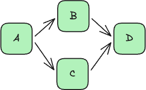
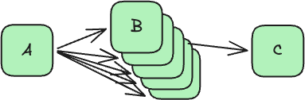
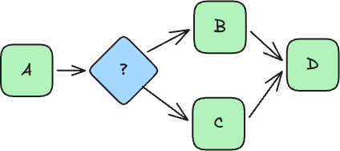
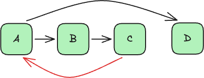

# Workflow Orchestration
### Concepts, Trade-offs, & 12-Tool Comparison

---

## What is Workflow Orchestration?

The automated coordination, management, and execution of interdependent tasks, microservices, and data pipelines.

It manages state transitions, enforces dependencies, handles failures, and tracks execution history across distributed systems.

---

## The Common Question

> *"Why do we need an orchestrator? Can't we just write Python scripts, cron jobs, or pub/sub events?"*

---

## The Alternatives to Orchestration

1. **The Monolith Script / Lambda**
   - Single process handling business logic AND control flow AND retries AND state tracking.

2. **Peer-to-Peer Choreography**
   - Services talking via pub/sub or direct REST calls. State is scattered across message topics and database tables.

---

## The "Do-It-Yourself" Pitfall

When you build pipelines without an orchestrator, you eventually need:

* Retries with exponential backoff and jitter
* Task dependency resolution & parallel execution
* A database to track job state and timestamps for idempotency
* Log aggregation & failure alerting
* A UI to find why step 99,648 of 100,000 failed

<strong>You end up re-inventing a workflow orchestrator — just more fragile, with zero visibility.</strong>

---

## What Happens When Step 3 of 10 Fails?

### Without an Orchestration Engine:
* The entire script or Lambda fails — **re-run from scratch**
* Risk of duplicating side effects (charging a card twice, re-inserting DB rows)
* Long-running operations time out
* Partial failures become total failures
* Answering *"Where is order #12345 stuck?"* requires searching log files across multiple servers

---

## Why Use a Workflow Orchestrator?

* **Reliability & Resiliency:** Built-in retries, timeouts, and saga/compensation for clean rollbacks.
* **Observability & Audit Trail:** Visual graph of execution, step-by-step I/O inspection, and instant status tracking.
* **State Persistence & Resume:** Resume directly from the failed step without repeating completed work.
* **Decoupled Architecture:** Business logic stays in clean, stateless workers; control flow is handled by the engine.
* **Backpressure & Concurrency:** Managed task queues, rate limiting, and dynamic fan-out.

---

## Orchestration vs. Choreography vs. State Tracking

* **Choreography (Pub/Sub):** Decentralized events. Easy for 2-3 services; impossible to track or reason about across complex multi-step workflows.
* **State Tracker (e.g. AASM / DB flag):** Tracks *where an object is* in its lifecycle, but doesn't execute anything. You still write the execution loop.
* **Workflow Orchestration Engine:** An **execution engine**. It calls services, enforces dependencies, handles retries, persists state, and drives execution automatically.

---

## What is a State Machine?

A model of computation defined by:

* A finite set of **states**
* A set of **transitions** between those states
* An **initial state**
* One or more **terminal states**

At any point in time, the system is in exactly one state. An event or condition causes it to transition to the next.

---

## Directed Acyclic Graphs (DAGs)

Workflows are commonly modeled as **DAGs**: directed, acyclic graphs.

* **Directed:** Edges have a clear direction ($A \rightarrow B$).
* **Acyclic:** No cycles or infinite loops allowed in the graph structure.

---

---

---

---

---

---

## Modular Architecture: Pull the Control Flow Out

* Each step is an independent worker with **one job**
* The workflow engine handles routing, state, retries, and error handling
* **Choice states** replace `if/else` logic
* **Parallel states** replace hand-rolled threads/concurrency
* **Map / Dynamic states** replace `for` loops over collections

---

## Visibility & Debugging

* See visually which step failed and why
* Inspect exact inputs and outputs at every step
* Re-run failed steps with the click of a button or single API call
* Full execution audit trail for compliance and debugging

---

## Common Architecture Patterns

Most orchestrators separate the **Control Plane** from the **Data Plane**:

* **Scheduler / Coordinator / Decider:** Tracks workflow state, evaluates transitions, enqueues tasks.
* **Worker Pool:** Pulls or receives tasks, executes business logic, and reports status back.

---

## The 12-Tool Orchestrator Bake-Off

To compare workflow orchestrators objectively, we implemented the **exact same 4 real-world DAGs** across 12 orchestration tools:

1. **AWS Step Functions**
2. **Apache Airflow**
3. **Argo Workflows**
4. **Dagster**
5. **Temporal**
6. **Kestra**
7. **Prefect**
8. **Flyte**
9. **Luigi**
10. **Hatchet**
11. **Google Workflows**
12. **Conductor**

---

## The 4 Benchmark DAGs

1. **DAG 1: CSV ETL** — Dynamic parallel CSV load into Postgres → SQL transform → Parquet.
2. **DAG 2: API Fanout & Callback** — Async callback (workflow suspends) → conditional branch → 30-item parallel detail fetches → combine.
3. **DAG 3: Payment Processing** — Validation → flaky gateway call with backoff/jitter → idempotent DB update → notification.
4. **DAG 4: Order Fulfillment** — Reserve inventory → human approval (suspends) → shipping → **saga compensation** on rejection/timeout.
